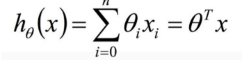
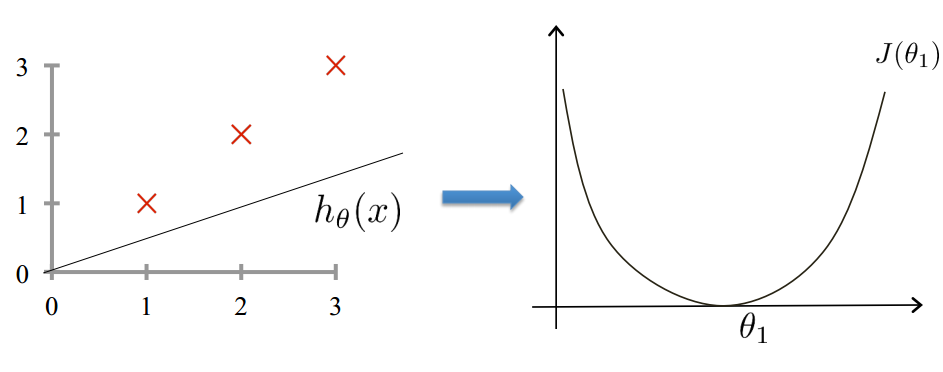
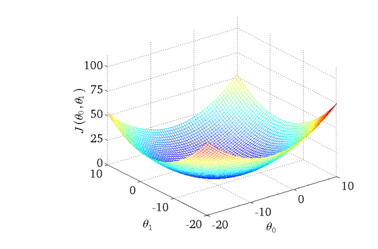

# 损失函数

### concept
学习算法的目标是找到最好的参数，然而怎么衡量这个最好的问题，从而引出损失函数loss function。

label相当于考试的标准答案，predict result与label之间差距叫做损失，衡量损失的函数叫做损失函数loss function。

### eg.
在线性回归中，model定义：

在线性回归model中，损失函数是取predict value与label value的方差，定义如下：

在参数是一元的情况下：

在多元的情况下：

平方loss在linear regression的情况下是一个凸函数，这意味着存在全局最优点，并且可能通过某些方法找到全局最优点。在deep learning中没有办法确保找到全局最优点，在工业上找到一个几乎是全局最优点的点，在工业上可以用就行了。

### 线性回归与梯度下降GD
请看下一节：

[梯度下降算法](https://github.com/bobkentt/Learning-machine-from-scratch-/blob/master/alg-base/ch1/%E6%A2%AF%E5%BA%A6%E4%B8%8B%E9%99%8D.md)

除了梯度下降算法外，还有牛顿法，拟牛顿法等等优化算法

### more
supervised learning中每个model都会定义一个loss function，例如：
* linear regression中的平方损失函数
* logistic regression中的log loss function
* svm算法中定义的hinge loss function

### last
有很多损失函数，在不同模型中适用。损失函数同时也是根据我们的目标而定，在deep learning中，有很多paper就是对损失函数做修改。
