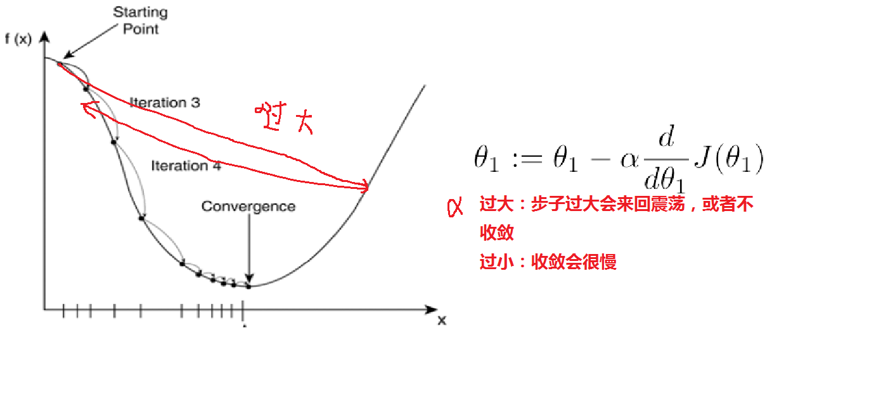
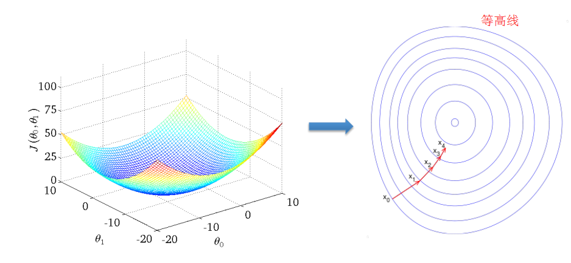

# 梯度下降算法 gradient degree algorithm

### 原理

梯度下降算法
* 梯度学习算法做的事情就是最小化损失函数；
* 梯度代表上升最快的方向，负梯度代表下降最快的方向，
* 在deep learning中，也用到了梯度下降算法，不过那时叫做随机梯度下降算法，SGD
* 通过上图的递推公式，不断的迭代参数，找到损失函数最小点
* 学习率是一个超参数（hyper parameter），只有设定好了超参数的值，算法才可以学

在多元的情况下：

在多元情况下，拿偏导，其实是在垂直于等高线的方向上，做梯度下降的。

### 学习率（learning rate）
非常重要的概念；
在deep learning 神经网络中， 很多时候算法不收敛的原因就是学习率。

以线性回归模型为例：
  ● 如果学习率α过大，会震荡的很厉害，甚至不收敛；
  ● 如果过小，可能收敛很慢；
  ● 在数学上，是可以找出比较优的学习率，但在工业应用上，找到一个差不多的α就可以了
  ● 随着逐步往下走，斜率会逐渐变小
  ● 工业上可能拍一组学习率，先去试一下，然后挑出一个
  ● 在学术上，有很多算法可以调整学习率

  ### eg.
  假设给定数据集：

  

  对损失函数求偏导如下：

  

  下面是更新的过程，也就是θi会向着梯度最小的方向进行减少。θi表示更新之前的值，-后面的部分表示按梯度方向减少的量，α表示步长，也就是每次按照梯度减少的方向变化多少。

  
  
