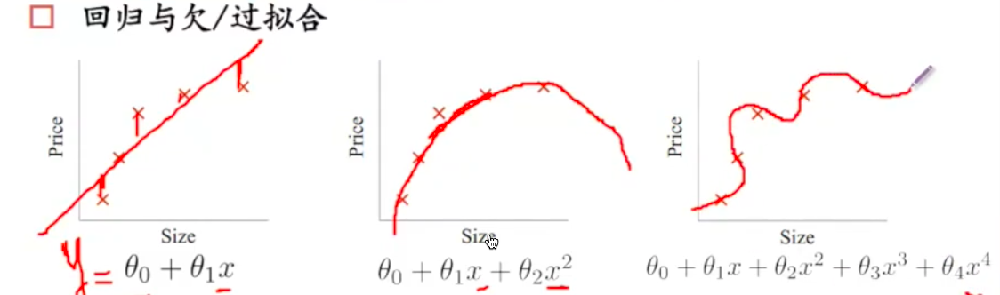

# 过拟合和正则化(underfitting vs overfitting)

## 模型的状态

模型很难训练到比较好的状态，很多时候模型会处于两种状态：
* underfitting
* overfitting

造成underfitting可能原因：
* 训练不够
* 模型本身的容量或能力不够（主要原因）

过拟合问题：
如果有非常多的特征/模型过于复杂，我们假设的曲线可以对模型拟合的非常好，但丧失了一般性，所以导致对新给出的带预测样本，预测效果差。

在工业上，一般使用的模型的容量是够的，
* 更多的参数，更复杂的模型，意味着更强的能力，但也更可能无法无天；
* 眼见不一定为实，看到的内容不一定是全部的真实的分布，死记硬背不太好；
