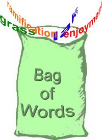
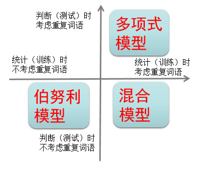
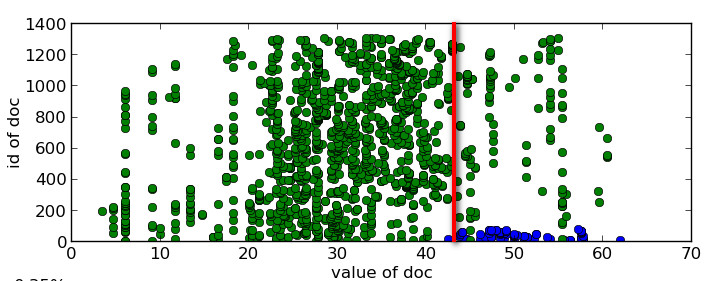

# 朴素贝叶斯[¶](#朴素贝叶斯)

## 1\. 引言[¶](#1.-引言)

贝叶斯方法是一个历史悠久，有着坚实的理论基础的方法，同时处理很多问题时直接而又高效，很多高级自然语言处理模型也可以从它演化而来。因此，学习贝叶斯方法，是研究自然语言处理问题的一个非常好的切入口。

## 2\. 贝叶斯公式[¶](#2.-贝叶斯公式)

贝叶斯公式就一行：

> 
$P(Y|X)=\frac{P(X|Y)P(Y)}{P(X)} $

而它其实是由以下的联合概率公式推导出来：

> 
$P(Y,X) = P(Y|X)P(X)=P(X|Y)P(Y) $

其中$P(Y)$叫做先验概率，$P(Y|X)$叫做后验概率，$P(Y,X)$叫做联合概率。

没了，贝叶斯最核心的公式就这么些。

## 3\. 用机器学习的视角理解贝叶斯公式[¶](#3.-用机器学习的视角理解贝叶斯公式)

在机器学习的视角下，我们把$X$理解成**“具有某特征”**，把$Y$理解成**“类别标签”**(一般机器学习为题中都是`X=>特征`, `Y=>结果`对吧)。在最简单的二分类问题(`是`与`否`判定)下，我们将$Y$理解成**“属于某类**”的标签。于是贝叶斯公式就变形成了下面的样子:

> $P(“属于某类”|“具有某特征”)=\frac{P(“具有某特征”|“属于某类”)P(“属于某类”)}{P(“具有某特征”)} $

我们简化解释一下上述公式：

> $P(“属于某类”|“具有某特征”)=$在已知某样本“具有某特征”的条件下，该样本“属于某类”的概率。所以叫做**『后验概率』**。  
> $P(“具有某特征”|“属于某类”)=$在已知某样本“属于某类”的条件下，该样本“具有某特征”的概率。  
> $P(“属于某类”) =$（在未知某样本具有该“具有某特征”的条件下，）该样本“属于某类”的概率。所以叫做**『先验概率』**。  
> $P(“具有某特征”) =$(在未知某样本“属于某类”的条件下，)该样本“具有某特征”的概率。

而我们二分类问题的最终目的就是要**判断$P(“属于某类”|“具有某特征”)$是否大于1/2**就够了。贝叶斯方法把计算**“具有某特征的条件下属于某类”**的概率转换成需要计算**“属于某类的条件下具有某特征”**的概率，而后者获取方法就简单多了，我们只需要找到一些包含已知特征标签的样本，即可进行训练。而样本的类别标签都是明确的，所以贝叶斯方法在机器学习里属于有监督学习方法。

这里再补充一下，一般**『先验概率』、『后验概率』是相对**出现的，比如$P(Y)$与$P(Y|X)$是关于$Y$的先验概率与后验概率，$P(X)$与$P(X|Y)$是关于$X$的先验概率与后验概率。

## 4\. 垃圾邮件识别[¶](#4.-垃圾邮件识别)

举个例子好啦，我们现在要对邮件进行分类，识别垃圾邮件和普通邮件，如果我们选择使用朴素贝叶斯分类器，那目标就是**判断$P(“垃圾邮件”|“具有某特征”)$是否大于1/2**。现在假设我们有垃圾邮件和正常邮件各1万封作为训练集。需要判断以下这个邮件是否属于垃圾邮件：

> “我司可办理正规发票（保真）17%增值税发票点数优惠！”

也就是**判断概率$P(“垃圾邮件”|“我司可办理正规发票（保真）17\%增值税发票点数优惠！”)$是否大于1/2**。

咳咳，有木有发现，转换成的这个概率，计算的方法：就是写个计数器，然后+1 +1 +1统计出所有垃圾邮件和正常邮件中出现这句话的次数啊！！！好，具体点说：

> $P(“垃圾邮件”|“我司可办理正规发票（保真）17\%增值税发票点数优惠！”)$ $ =\frac{垃圾邮件中出现这句话的次数}{垃圾邮件中出现这句话的次数+正常邮件中出现这句话的次数}$

## 5\. 分词[¶](#5.-分词)

一个很悲哀但是很现实的结论： **训练集是有限的，而句子的可能性则是无限的。所以覆盖所有句子可能性的训练集是不存在的。**

所以解决方法是？ **句子的可能性无限，但是词语就那么些！！**汉语常用字2500个，常用词语也就56000个(你终于明白小学语文老师的用心良苦了)。按人们的经验理解，两句话意思相近并不强求非得每个字、词语都一样。比如**“我司可办理正规发票，17%增值税发票点数优惠！”**，这句话就比之前那句话少了**“（保真）”**这个词，但是意思基本一样。如果把这些情况也考虑进来，那样本数量就会增加，这就方便我们计算了。

于是，我们可以不拿句子作为特征，而是拿句子里面的词语（组合）作为特征去考虑。比如**“正规发票”**可以作为一个单独的词语，**“增值税”**也可以作为一个单独的词语等等。

> 句子**“我司可办理正规发票，17%增值税发票点数优惠！”就可以变成（“我”,“司”,“可”,“办理”,“正规发票”,“保真”,“增值税”,“发票”,“点数”,“优惠”)）**。

于是你接触到了中文NLP中，最最最重要的技术之一：**分词**！！！也就是**把一整句话拆分成更细粒度的词语来进行表示**。另外，分词之后**去除标点符号、数字甚至无关成分(停用词)是特征预处理中的一项技术**。

**中文分词是一个专门的技术领域(我不会告诉你某搜索引擎厂码砖工有专门做分词的！！！)，上过之前课程的同学都知道python有一个非常方便的分词工具jieba，假定我们已经完成分词工作：**

我们观察（“我”,“司”,“可”,“办理”,“正规发票”,“保真”,“增值税”,“发票”,“点数”,“优惠”)，**这可以理解成一个向量：向量的每一维度都表示着该特征词在文本中的特定位置存在。这种将特征拆分成更小的单元，依据这些更灵活、更细粒度的特征进行判断的思维方式，在自然语言处理与机器学习中都是非常常见又有效的。**

因此贝叶斯公式就变成了：

> $P(“垃圾邮件”|（“我”,“司”,“可”,“办理”,“正规发票”,“保真”,“增值税”,“发票”,“点数”,“优惠”)）$ $=\frac{P(（“我”,“司”,“可”,“办理”,“正规发票”,“保真”,“增值税”,“发票”,“点数”,“优惠”)|"垃圾邮件"）P(“垃圾邮件”)}{P(（“我”,“司”,“可”,“办理”,“正规发票”,“保真”,“增值税”,“发票”,“点数”,“优惠”)) }$
> 
> $P(“正常邮件”|（“我”,“司”,“可”,“办理”,“正规发票”,“保真”,“增值税”,“发票”,“点数”,“优惠”)）$ $=\frac{P(（“我”,“司”,“可”,“办理”,“正规发票”,“保真”,“增值税”,“发票”,“点数”,“优惠”)|"正常邮件"）P(“正常邮件”)}{P(（“我”,“司”,“可”,“办理”,“正规发票”,“保真”,“增值税”,“发票”,“点数”,“优惠”)) }$

## 6\. 条件独立假设[¶](#6.-条件独立假设)

下面我们马上会看到一个非常简单粗暴的假设。

概率$P(（“我”,“司”,“可”,“办理”,“正规发票”,“保真”,“增值税”,“发票”,“点数”,“优惠”)|"垃圾邮件"）$依旧不够好求，我们引进一个**很朴素的近似**。为了让公式显得更加紧凑，我们令字母S表示“垃圾邮件”,令字母H表示“正常邮件”。近似公式如下：

> $P(（“我”,“司”,“可”,“办理”,“正规发票”,“保真”,“增值税”,“发票”,“点数”,“优惠”)|S）$  
> $=P(“我”|S）×P(“司”|S）×P(“可”|S）×P(“办理”|S）×P(“正规发票”|S）$ $×P(“保真”|S）×P(“增值税”|S）×P(“发票”|S）×P(“点数”|S）×P(“优惠”|S)$

这就是传说中的**条件独立假设**。基于“正常邮件”的条件独立假设的式子与上式类似，此处省去。接着，将条件独立假设代入上面两个相反事件的贝叶斯公式。

于是我们就只需要比较以下两个式子的大小：

> $C = P(“我”|S)P(“司”|S)P(“可”|S)P(“办理”|S)P(“正规发票”|S)$ $×P(“保真”|S)P(“增值税”|S)P(“发票”|S)P(“点数”|S)P(“优惠”|S)P(“垃圾邮件”)$ $\overline{C}=P(“我”|H)P(“司”|H)P(“可”|H)P(“办理”|H)P(“正规发票”|H)$ $×P(“保真”|H)P(“增值税”|H)P(“发票”|H)P(“点数”|H)P(“优惠”|H)P(“正常邮件”) $

厉(wo)害(cao)！酱紫处理后**式子中的每一项都特别好求**！只需要**分别统计各类邮件中该关键词出现的概率**就可以了！！！比如：

> $P(“发票”|S）=\frac{垃圾邮件中所有“发票”的次数}{垃圾邮件中所有词语的次数}$

统计次数非常方便，而且样本数量足够大，算出来的概率比较接近真实。于是垃圾邮件识别的问题就可解了。

## 7\. 朴素贝叶斯(Naive Bayes)，“Naive”在何处？[¶](#7.-朴素贝叶斯(Naive-Bayes)，“Naive”在何处？)

**加上条件独立假设的贝叶斯方法就是朴素贝叶斯方法（Naive Bayes）。** Naive的发音是“乃一污”，意思是“朴素的”、“幼稚的”、**“蠢蠢的”**。咳咳，也就是说，大神们取名说该方法是一种比较萌蠢的方法，为啥？

将句子（“我”,“司”,“可”,“办理”,“正规发票”) 中的 （“我”,“司”）与（“正规发票”）调换一下顺序，就变成了一个新的句子（“正规发票”,“可”,“办理”, “我”, “司”)。新句子与旧句子的意思完全不同。**但由于乘法交换律，朴素贝叶斯方法中算出来二者的条件概率完全一样！**计算过程如下：

> $P(（“我”,“司”,“可”,“办理”,“正规发票”)|S)$ $=P(“我”|S)P(“司”|S)P(“可”|S)P(“办理”|S)P(“正规发票”|S) $ $=P(“正规发票”|S)P(“可”|S)P(“办理”|S)P(“我”|S)P(“司”|S）$ $=P(（“正规发票”,“可”,“办理”, “我”, “司”)|S)$

**也就是说，在朴素贝叶斯眼里，“我司可办理正规发票”与“正规发票可办理我司”完全相同。朴素贝叶斯失去了词语之间的顺序信息。**这就相当于把所有的词汇扔进到一个袋子里随便搅和，贝叶斯都认为它们一样。因此这种情况也称作**词袋子模型(bag of words)**。

词袋子模型与人们的日常经验完全不同。比如，在条件独立假设的情况下，**“武松打死了老虎”与“老虎打死了武松”被它认作一个意思了。**恩，朴素贝叶斯就是这么单纯和直接，对比于其他分类器，好像是显得有那么点萌蠢。

## 8\. 简单高效，吊丝逆袭[¶](#8.-简单高效，吊丝逆袭)

虽然说朴素贝叶斯方法萌蠢萌蠢的，但实践证明在垃圾邮件识别的应用还**令人诧异地好**。Paul Graham先生自己简单做了一个朴素贝叶斯分类器，**“1000封垃圾邮件能够被过滤掉995封，并且没有一个误判”。**（Paul Graham《黑客与画家》）

那个...效果为啥好呢？

“有人对此提出了一个理论解释，并且建立了什么时候朴素贝叶斯的效果能够等价于非朴素贝叶斯的充要条件，这个解释的核心就是：有些独立假设在各个分类之间的分布都是均匀的所以对于似然的相对大小不产生影响；即便不是如此，也有很大的可能性**各个独立假设所产生的消极影响或积极影响互相抵消，最终导致结果受到的影响不大**。具体的数学公式请参考[这篇 paper](http://www.cs.unb.ca/profs/hzhang/publications/FLAIRS04ZhangH.pdf)。”（刘未鹏《：平凡而又神奇的贝叶斯方法》）

恩，这个分类器中最简单直接看似萌蠢的小盆友『朴素贝叶斯』，实际上却是**简单、实用、且强大**的。

## 9\. 处理重复词语的三种方式[¶](#9.-处理重复词语的三种方式)

我们**之前的垃圾邮件向量（“我”,“司”,“可”,“办理”,“正规发票”,“保真”,“增值税”,“发票”,“点数”,“优惠”)，其中每个词都不重复。**而这在现实中其实很少见。因为如果文本长度增加，或者分词方法改变，**必然会有许多词重复出现**，因此需要对这种情况进行进一步探讨。比如以下这段邮件：

> “代开发票。增值税发票，正规发票。” 分词后为向量： （“代开”,“发票”,“增值税”,“发票”,“正规”,“发票”）

其中“发票”重复了三次。

### 9.1 多项式模型：[¶](#9.1-多项式模型：)

如果我们考虑重复词语的情况，也就是说，**重复的词语我们视为其出现多次**，直接按条件独立假设的方式推导，则有

> $P(（“代开”,“发票”,“增值税”,“发票”,“正规”,“发票”)|S）$ $=P(“代开””|S)P(“发票”|S)P(“增值税”|S)P(“发票”|S)P(“正规”|S)P(“发票”|S）$ $=P(“代开””|S)P^3(“发票”|S)P(“增值税”|S)P(“正规”|S)$ **注意这一项**:$P^3(“发票”|S）$。

在统计计算P(“发票”|S）时，每个被统计的垃圾邮件样本中重复的词语也统计多次。

> $P(“发票”|S）=\frac{每封垃圾邮件中出现“发票”的次数的总和}{每封垃圾邮件中所有词出现次数（计算重复次数）的总和}$

你看这个多次出现的结果，出现在概率的指数/次方上，因此这样的模型叫作**多项式模型**。

### 9.2 伯努利模型[¶](#9.2-伯努利模型)

另一种更加简化的方法是**将重复的词语都视为其只出现1次**，

> $P(（“代开”,“发票”,“增值税”,“发票”,“正规”,“发票”)|S）$ $=P(“发票”|S)P(“代开””|S)P(“增值税”|S)P(“正规”|S）$

统计计算$P(“词语”|S）$时也是如此。

> $P(“发票”|S）=\frac{出现“发票”的垃圾邮件的封数}{每封垃圾邮件中所有词出现次数（出现了只计算一次）的总和}$

这样的模型叫作**伯努利模型**（又称为**二项独立模型**）。这种方式更加简化与方便。当然它丢失了词频的信息，因此效果可能会差一些。

### 9.3 混合模型[¶](#9.3-混合模型)

第三种方式是在计算句子概率时，不考虑重复词语出现的次数，但是在统计计算词语的概率P(“词语”|S）时，却考虑重复词语的出现次数，这样的模型可以叫作**混合模型**。

我们通过下图展示三种模型的关系。

具体实践中采用那种模型，关键看具体的业务场景，一个简单经验是，**对于垃圾邮件识别，混合模型更好些**。

## 10\. 去除停用词与选择关键词[¶](#10.-去除停用词与选择关键词)

我们继续观察**（“我”,“司”,“可”,“办理”,“正规发票”,“保真”,“增值税”,“发票”,“点数”,“优惠”)** 这句话。其实，像**“我”、“可”**之类词其实非常中性，无论其是否出现在垃圾邮件中都无法帮助判断的有用信息。所以可以直接不考虑这些典型的词。这些无助于我们分类的词语叫作**“停用词”（Stop Words）**。这样可以**减少我们训练模型、判断分类的时间**。 于是之前的句子就变成了**（“司”,“办理”,“正规发票”,“保真”,“增值税”,“发票”,“点数”,“优惠”)** 。

我们进一步分析。以人类的经验，其实**“正规发票”、“发票”**这类的词如果出现的话，邮件作为垃圾邮件的概率非常大，可以作为我们区分垃圾邮件的**“关键词”**。而像**“司”、“办理”、“优惠”**这类的词则有点鸡肋，可能有助于分类，但又不那么强烈。如果想省事做个简单的分类器的话，则可以直接采用“关键词”进行统计与判断，剩下的词就可以先不管了。于是之前的垃圾邮件句子就变成了**（“正规发票”,“发票”)** 。这样就更加减少了我们训练模型、判断分类的时间，速度非常快。

**“停用词”和“关键词”一般都可以提前靠人工经验指定**。不同的“停用词”和“关键词”训练出来的分类器的效果也会有些差异。

## 11\. 浅谈平滑技术[¶](#11.-浅谈平滑技术)

我们来说个问题(中文NLP里问题超级多，哭瞎T_T)，比如在计算以下独立条件假设的概率：

> $P(（“我”,“司”,“可”,“办理”,“正规发票”)|S)$ $=P(“我”|S)P(“司”|S)P(“可”|S)P(“办理”|S)P(“正规发票”|S）$

我们扫描一下训练集，发现**“正规发票”这个词从出现过！！！*，于是$P(“正规发票”|S）=0$...问题严重了，整个概率都变成0了！！！朴素贝叶斯方法面对一堆0，很凄惨地失效了...更残酷的是**这种情况其实很常见**，因为哪怕训练集再大，也可能有覆盖不到的词语。本质上还是**样本数量太少，不满足大数定律，计算出来的概率失真**。为了解决这样的问题，一种分析思路就是直接不考虑这样的词语，但这种方法就相当于默认给P(“正规发票”|S）赋值为1。其实效果不太好，大量的统计信息给浪费掉了。我们进一步分析，既然可以默认赋值为1，为什么不能默认赋值为一个很小的数？这就是平滑技术的基本思路，依旧保持着一贯的作风，`朴实/土`但是`直接而有效`。

对于伯努利模型，P(“正规发票”|S）的一种平滑算法是：

> $P(“正规发票”|S）=\frac{出现“正规发票”的垃圾邮件的封数+1}{每封垃圾邮件中所有词出现次数（出现了只计算一次）的总和+2}$

对于多项式模型，P(“正规发票”| S）的一种平滑算法是：

> $P(“发票”|S）=\frac{每封垃圾邮件中出现“发票”的次数的总和+1}{每封垃圾邮件中所有词出现次数（计算重复次数）的总和+被统计的词表的词语数量}$

说起来，平滑技术的种类其实非常多，有兴趣的话回头我们专门拉个专题讲讲好了。这里只提一点，就是所有的**平滑技术都是给未出现在训练集中的词语一个估计的概率，而相应地调低其他已经出现的词语的概率**。

平滑技术是因为数据集太小而产生的现实需求。**如果数据集足够大，平滑技术对结果的影响将会变小。**

## 12\. 内容小结[¶](#12.-内容小结)

我们找了个最简单常见的例子：垃圾邮件识别，说明了一下朴素贝叶斯进行文本分类的思路过程。基本思路是先区分好训练集与测试集，对文本集合进行分词、去除标点符号等特征预处理的操作，然后使用条件独立假设，将原概率转换成词概率乘积，再进行后续的处理。

> 
贝叶斯公式 + 条件独立假设 = 朴素贝叶斯方法

基于对重复词语在训练阶段与判断（测试）阶段的三种不同处理方式，我们相应的有伯努利模型、多项式模型和混合模型。在训练阶段，如果样本集合太小导致某些词语并未出现，我们可以采用平滑技术对其概率给一个估计值。而且并不是所有的词语都需要统计，我们可以按相应的“停用词”和“关键词”对模型进行进一步简化，提高训练和判断速度。

## 13\. 为什么不直接匹配关键词来识别垃圾邮件？[¶](#13.-为什么不直接匹配关键词来识别垃圾邮件？)

有同学可能会问：“何必费这么大劲算那么多词的概率？直接看邮件中有没有‘代开发票’、‘转售发票’之类的关键词不就得了？如果关键词比较多就认为是垃圾邮件呗。”

其实关键词匹配的方法如果有效的话真不必用朴素贝叶斯。毕竟这种方法简单嘛，**就是一个字符串匹配**。从历史来看，之前没有贝叶斯方法的时候主要也是用关键词匹配。**但是这种方法准确率太低**。我们在工作项目中也尝试过用关键词匹配的方法去进行文本分类，发现大量误报。感觉就像扔到垃圾箱的邮件99%都是正常的！这样的效果不忍直视。而加一个朴素贝叶斯方法就可能把误报率拉低近一个数量级，体验好得不要不要的。

**另一个原因是词语会随着时间不断变化**。发垃圾邮件的人也不傻，当他们发现自己的邮件被大量屏蔽之后，也会考虑采用新的方式，**如变换文字、词语、句式、颜色等方式来绕过反垃圾邮件系统**。比如对于垃圾邮件“我司可办理正规发票，17%增值税发票点数优惠”,他们采用火星文：**“涐司岢办理㊣規髮票，17%增値稅髮票嚸數優蕙”**，那么字符串匹配的方法又要重新找出这些火星文，一个一个找出关键词，重新写一些匹配规则。更可怕的是，这些规则可能相互之间的耦合关系异常复杂，要把它们梳理清楚又是大一个数量级的工作量。等这些规则失效了又要手动更新新的规则……**无穷无尽猫鼠游戏最终会把猫给累死**。

而朴素贝叶斯方法却显示出无比的优势。因为它是**基于统计方法**的，只要训练样本中有更新的垃圾邮件的新词语，哪怕它们是火星文，**都能自动地把哪些更敏感的词语（如“髮”、“㊣”等）给凸显出来，并根据统计意义上的敏感性给他们分配适当的权重** ，这样就不需要什么人工了，非常省事。**你只需要时不时地拿一些最新的样本扔到训练集中，重新训练一次即可**。

小补充一下，对于火星文、同音字等替代语言，一般的分词技术可能会分得不准，最终可能只把一个一个字给分出来，成为“分字”。效果可能不会太好。也可以用过n-gram之类的语言模型，拿到最常见短语。当然，对于英文等天生自带空格来间隔单词的语言，分词则不是什么问题，使用朴素贝叶斯方法将会更加顺畅。

## 14.实际工程的tricks[¶](#14.实际工程的tricks)

应用朴素贝叶斯方法的过程中，一些tricks能显著帮助工程解决问题。我们毕竟经验有限，无法将它们全都罗列出来，只能就所知的一点点经验与大家分享，欢迎批评指正。

### 14.1 trick1：取对数[¶](#14.1-trick1：取对数)

我们提到用来识别垃圾邮件的方法是比较以下两个概率的大小（字母S表示“垃圾邮件”,字母H表示“正常邮件”）：

> $C = P(“我”|S)P(“司”|S)P(“可”|S)P(“办理”|S)P(“正规发票”|S)$
> 
> $×P(“保真”|S)P(“增值税”|S)P(“发票”|S)P(“点数”|S)P(“优惠”|S)P(“垃圾邮件”)$
> 
> $\overline{C}=P(“我”|H)P(“司”|H)P(“可”|H)P(“办理”|H)P(“正规发票”|H)$
> 
> $×P(“保真”|H)P(“增值税”|H)P(“发票”|H)P(“点数”|H)P(“优惠”|H)P(“正常邮件”)$

但这里进行了**很多乘法运算，计算的时间开销比较大**。尤其是对于篇幅比较长的邮件，几万个数相乘起来还是非常花时间的。如果能**把这些乘法变成加法则方便得多**。刚好数学中的对数函数log就可以实现这样的功能。两边同时取对数（本文统一取底数为2），则上面的公式变为：

> $log{C} = log{P(“我”|S)}+log{P(“司”|S)}+log{P(“可”|S)}+log{P(“办理”|S)}+log{P(“正规发票”|S)}$
> 
> $+log{P(“保真”|S)}+log{P(“增值税”|S)}+log{P(“发票”|S)}+log{P(“点数”|S)}+log{P(“优惠”|S)}+log{P(“垃圾邮件”)}$
> 
> $log{\overline{C}}=log{P(“我”|H)}+log{P(“司”|H)}+log{P(“可”|H)}+log{P(“办理”|H)}+log{P(“正规发票”|H)}$
> 
> $+log{P(“保真”|H)}+log{P(“增值税”|H)}+log{P(“发票”|H)}+log{P(“点数”|H)}+log{P(“优惠”|H)}+log{P(“正常邮件”)}$

有同学可能要叫了：“做对数运算岂不会也很花时间？”的确如此，但是可以在训练阶段直接计算 $log{P}$ ，然后把他们存在一张大的hash表里。**在判断的时候直接提取hash表中已经计算好的对数概率，然后相加即可。这样使得判断所需要的计算时间被转移到了训练阶段**，实时运行的时候速度就比之前快得多，这可不止几个数量级的提升。

### 14.2 trick2：转换为权重[¶](#14.2-trick2：转换为权重)

对于二分类，我们还可以继续提高判断的速度。既然要比较$log{C}$ 和$log{\overline{C}}$ 的大小，那就可以直接将上下两式相减，并继续化简：

> $log{\frac{C}{\overline{C}}}=log{\frac{P(“我”|S)}{P(“我”|H)}}+log{\frac{P(“司”|S)}{P(“司”|H)}}+log{\frac{P(“可”|S)}{P(“可”|H)}}+log{\frac{P(“办理”|S)}{P(“办理”|H)}}+log{\frac{P(“正规发票”|S)}{P(“正规发票”|H)}}$
> 
> $+log{\frac{P(“保真”|S)}{P(“保真”|H)}}+log{\frac{P(“增值税”|S)}{P(“增值税”|H)}}+log{\frac{P(“发票”|S)}{P(“发票”|H)}}+log{\frac{P(“点数”|S)}{P(“点数”|H)}}+log{\frac{P(“优惠”|S)}{P(“优惠”|H)}}+log{\frac{P(“正常邮件”|S)}{P(“正常邮件”)}}$

**$log{\frac{C}{\overline{C}}}$ 如果大于0则属于垃圾邮件。我们可以把其中每一项作为其对应词语的权重**，比如$log{\frac{P(“发票”|S)}{P(“发票”|H)}}$ 就可以作为词语“发票”的权重，权重越大就越说明“发票”更可能是与“垃圾邮件”相关的特征。**这样可以根据权重的大小来评估和筛选显著的特征，比如关键词。而这些权重值可以直接提前计算好而存在hash表中** 。判断的时候直接将权重求和即可。

关键词hash表的样子如下，左列是权重，右列是其对应的词语，权重越高的说明越“关键”：

### 14.3 trick3：选取topk的关键词[¶](#14.3-trick3：选取topk的关键词)

前文说过可以通过提前选取关键词来提高判断的速度。有一种方法可以省略提前选取关键词的步骤，**就是直接选取一段文本中权重最高的K个词语，将其权重进行加和**。比如Paul Graham 在《黑客与画家》中是选取邮件中权重最高的15个词语计算的。

通过权重hash表可知，如果是所有词语的权重，则权重有正有负。如果只选择权重最高的K个词语，则它们的权重基本都是正的。所以就不能像之前那样判断$log{\frac{C}{\overline{C}}}$ 是否大于0来区分邮件了。而这**需要依靠经验选定一个正数的阈值（门槛值）** ，依据$log{\frac{C}{\overline{C}}}$ 与该门槛值的大小来识别垃圾邮件。

如下图所示，蓝色点代表垃圾邮件，绿色点代表正常邮件，横坐标为计算出来的$log{\frac{C}{\overline{C}}}$ 值，中间的红线代表阈值。

### 14.4 trick4：分割样本[¶](#14.4-trick4：分割样本)

选取topk个词语的方法对于篇幅变动不大的邮件样本比较有效。但是对篇幅过大或者过小的邮件则会有判断误差。

比如这个垃圾邮件的例子：（“我”,“司”,“可”,“办理”,“正规发票”,“保真”,“增值税”,“发票”,“点数”,“优惠”)。分词出了10个词语，其中有“正规发票”、“发票”2个关键词。关键词的密度还是蛮大的，应该算是敏感邮件。但因为采用最高15个词语的权重求和，并且相应的阈值是基于15个词的情况有效，可能算出来的结果还小于之前的阈值，这就造成漏判了。

类似的，如果一封税务主题的邮件有1000个词语，其中只有“正规发票”、“发票”、“避税方法”3个权重比较大的词语，它们只是在正文表述中顺带提到的内容。关键词的密度被较长的篇幅稀释了，应该算是正常邮件。但是却被阈值判断成敏感邮件，造成误判了。

**这两种情况都说明topk关键词的方法需要考虑篇幅的影响**。这里有许多种处理方式，**它们的基本思想都是选取词语的个数及对应的阈值要与篇幅的大小成正比**，本文只介绍其中一种方方法：

*   对于长篇幅邮件，按一定的大小，比如每500字，将其分割成小的文本段落，再对小文本段落采用topk关键词的方法。只要其中有一个小文本段落超过阈值就判断整封邮件是垃圾邮件。

*   对于超短篇幅邮件，比如50字，可以按篇幅与标准比较篇幅的比例来选取topk，以确定应该匹配关键词语的个数。比如选取 $\frac{50}{500}×15≈2$ 个词语进行匹配，相应的阈值可以是之前阈值的 $\frac{2}{15}$ 。以此来判断则更合理。

### 14.5 trick5：位置权重[¶](#14.5-trick5：位置权重)

到目前为止，我们对词语权重求和的过程都没有考虑邮件篇章结构的因素。比如“正规发票”如果出现在标题中应该比它出现在正文中对判断整个邮件的影响更大；而出现在段首句中又比其出现在段落正文中对判断整个邮件的影响更大。**所以可以根据词语出现的位置，对其权重再乘以一个放大系数，以扩大其对整封邮件的影响，提高识别准确度**。

比如一封邮件其标题是“正规发票”（假设标题的放大系数为2），段首句是“发票”,“点数”,“优惠”（假设段首的放大系数为1.5），剩下的句子是（“我”,“司”,“可”,“办理”,“保真”）。则计算$log{\frac{C}{\overline{C}}}$ 时的公式就可以调整为：

> $log{\frac{C}{\overline{C}}}=2×log{\frac{P(“正规发票”|S)}{P(“正规发票”|H)}}+1.5×log{\frac{P(“发票”|S)}{P(“发票”|H)}}+1.5×log{\frac{P(“点数”|S)}{P(“点数”|H)}}+1.5×log{\frac{P(“优惠”|S)}{P(“优惠”|H)}}$
> 
> $+log{\frac{P(“我”|S)}{P(“我”|H)}}+log{\frac{P(“司”|S)}{P(“司”|H)}}+log{\frac{P(“可”|S)}{P(“可”|H)}}+log{\frac{P(“办理”|S)}{P(“办理”|H)}}+log{\frac{P(“保真”|S)}{P(“保真”|H)}}+log{\frac{P(“正常邮件”|S)}{P(“正常邮件”)}}$

### 14.6 trick6：蜜罐[¶](#14.6-trick6：蜜罐)

我们通过辛辛苦苦的统计与计算，好不容易得到了不同词语的权重。然而这并不是一劳永逸的。我们我们之前交代过，**词语及其权重会随着时间不断变化，需要时不时地用最新的样本来训练以更新词语及其权重**。

而搜集最新垃圾邮件有一个技巧，就是随便注册一些邮箱，然后将它们公布在各大论坛上。接下来就坐等一个月，到时候收到的邮件就绝大部分都是垃圾邮件了（好奸诈）。再找一些正常的邮件，基本就能够训练了。这些用于自动搜集垃圾邮件的邮箱叫做“蜜罐”。**“蜜罐”是网络安全领域常用的手段，因其原理类似诱捕昆虫的装有蜜的罐子而得名**。比如杀毒软件公司会利用蜜罐来监视或获得计算机网络中的病毒样本、攻击行为等。

## 15\. 贝叶斯方法的思维方式[¶](#15.-贝叶斯方法的思维方式)

讲了这么多tricks，但这些手段都是建立在贝叶斯方法基础之上的。因此有必要探讨一下贝叶斯方法的思维方式，以便更好地应用这种方法解决实际问题。

### 15.1 逆概问题[¶](#15.1-逆概问题)

我们重新看一眼贝叶斯公式：

> $P(Y|X)=\frac{P(X|Y)P(Y)}{P(X)}$

先不考虑先验概率$P(Y)与P(X)$，观察两个后验概率$P(Y|X)与P(X|Y)$，可见贝叶斯公式能够揭示**两个相反方向的条件概率之间的转换关系**。

从贝叶斯公式的发现历史来看，其就是为了处理所谓“逆概”问题而诞生的。比如$P(Y|X)$ 不能通过直接观测来得到结果，而$P(X|Y)$ 却容易通过直接观测得到结果，就可以通过贝叶斯公式**从间接地观测对象去推断不可直接观测的对象的情况**。

好吧，我们说人话。基于邮件的文本内容判断其属于垃圾邮件的概率不好求（不可通过直接观测、统计得到），但是基于已经搜集好的垃圾邮件样本，去统计（直接观测）其文本内部各个词语的概率却非常方便。这就可以用贝叶斯方法。

引申一步，基于样本特征去判断其所属标签的概率不好求，但是基于已经搜集好的打上标签的样本（有监督），却可以直接统计属于同一标签的样本内部各个特征的概率分布。因此贝叶斯方法的理论视角适用于一切分类问题的求解。

### 15.2 处理多分类问题[¶](#15.2-处理多分类问题)

前面我们一直在探讨二分类（判断题）问题，现在可以引申到多分类（单选题）问题了。

还是用邮件分类的例子，这是现在不只要判断垃圾邮件，还要将正常邮件细分为私人邮件、工作邮件。现在有这3类邮件各1万封作为样本。需要训练出一个贝叶斯分类器。这里依次用$Y_1,Y_2,Y_3$表示这三类邮件，用$X$表示被判断的邮件。套用贝叶斯公式有：

> $P(Y_1|X)=\frac{P(X|Y_1)P(Y_1)}{P(X)}$
> 
> $P(Y_2|X)=\frac{P(X|Y_2)P(Y_2)}{P(X)}$
> 
> $P(Y_3|X)=\frac{P(X|Y_3)P(Y_3)}{P(X)}$

通过比较3个概率值的大小即可得到$X$所属的分类。发现三个式子的分母$P(X)$ 一样，比较大小时可以忽略不计，于是就可以用下面这一个式子表达上面3式：

> $P(Y_i|X)\propto P(X|Y_i)P(Y_i) ； i=1,2,3$

其中 $\propto$ 表示“正比于”。而$P(X|Y_i)$ 则有个特别高逼格的名字叫做“**似然函数**”。我们上大学的时候也被这个名字搞得晕晕乎乎的，其实它也是个概率，直接理解成**“$P(Y_i|X)$ 的逆反条件概率”** 就方便了。

这里只是以垃圾邮件3分类问题举了个例子，**对于任意多分类的问题都可以用这样的思路去理解。比如新闻分类、情感喜怒哀乐分类等等**。

### 15.3 先验概率的问题[¶](#15.3-先验概率的问题)

在垃圾邮件的例子中，先验概率都相等，$P(Y_1)=P(Y_2)=P(Y_3)=10000/30000=1/3$，所以上面是式子又可以进一步化简：

> $P(Y_i|X)\propto P(X|Y_i) ； i=1,2,3$

只需比较右边式子（也就是“似然函数”）的大小就可以了。这种方法就是传说中的**最大似然法**:不考虑先验概率而直接比较似然函数。

关于选出最佳分类$Y_i$是否要考虑先验概率$P(Y_i)$的问题，曾经在频率学派和贝叶斯学派之间产生了激烈的教派冲突。统计学家（频率学派）说：我们让数据自己说话。言下之意就是要摒弃先验概率。而贝叶斯学派支持者则说：数据会有各种各样的偏差，而一个**靠谱的先验概率**则可以对这些随机噪音做到健壮。对此有兴趣的同学可以找更多资料进行了解，本文在此不做更多的引申，只基于垃圾邮件识别的例子进行探讨。

比如我们在采集垃圾邮件样本的时候，不小心delete掉了一半的数据，就剩下5000封邮件。则计算出来的先验概率为:

> $P(Y_1)=5000/25000=1/5$，
> 
> $P(Y_2)=P(Y_3)=10000/25000=2/5$

如果还用贝叶斯方法,就要在似然函数后面乘上先验概率。比如之前用最大似然法算出$Y_1$ 垃圾邮件的概率大，但是因为$P(Y_1)$特别小，用贝叶斯方法得出的结果是$Y_2$ 私人邮件的概率大。那相信哪个呢？其实，我们删掉了部分带标签的样本，从计算结果看$P(Y_1)，P(Y_2)，P(Y_3)$的概率分布变化了，但实际上**这三个类别的真实分布应该是一个客观的状态，不应该因为我们的计算方法而发生变化**。所以是我们计算出来的先验概率失真，应该放弃这样计算出来的先验概率，而用最大似然法。但即便我们不删掉一半垃圾邮件，这三类邮件的分布就真的是1:1:1那样平均吗？那也未必。**我们只是按1:1:1这样的方式进行了抽样而已，真正在邮箱里收到的这三类邮件的分布可能并不是这样**。也就是说，**在我们对于先验概率一无所知时，只能假设每种猜测的先验概率是均等的（其实这也是人类经验的结果），这个时候就只有用最大似然了**。在现实运用过程中如果发现最大似然法有偏差，可以考虑对不同的似然函数设定一些系数或者阈值，使其接近真实情况。

但是，**如果我们有足够的自信，训练集中这三类的样本分布的确很接近真实的情况，这时就应该用贝叶斯方法**。难怪前面的贝叶斯学派强调的是“靠谱的先验概率”。所以说**贝叶斯学派的适用范围更广，关键要先验概率靠谱，而频率学派有效的前提也是他们的先验概率同样是经验统计的结果**。

## 16\. (朴素)贝叶斯方法的常见应用[¶](#16.-(朴素)贝叶斯方法的常见应用)

说了这么多理论的问题，咱们就可以探讨一下(朴素)贝叶斯方法在自然语言处理中的一些常见应用了。以下只是从原理上进行探讨，对于具体的技术细节顾及不多。

### 16.1 褒贬分析[¶](#16.1-褒贬分析)

一个比较常见的应用场景是情感褒贬分析。比如你要统计微博上人们对一个新上映电影的褒贬程度评价：好片还是烂片。但是一条一条地看微博是根本看不过来，只能用自动化的方法。我们可以有一个很粗略的思路：

*   首先是用爬虫将微博上提到这个电影名字的微博全都抓取下来，比如有10万条。

*   然后用训练好的朴素贝叶斯分类器分别判断这些微博对电影是好评还是差评。

*   最后统计出这些好评的影评占所有样本中的比例，就能形成微博网友对这个电影综合评价的大致估计。

接下来的核心问题就是训练出一个靠谱的分类器。首先需要有打好标签的文本。这个好找，豆瓣影评上就有大量网友对之前电影的评价，并且对电影进行1星到5星的评价。我们可以认为3星以上的评论都是好评，3星以下的评论都是差评。这样就分别得到了好评差评两类的语料样本。剩下就可以用朴素贝叶斯方法进行训练了。基本思路如下：

*   训练与测试样本：豆瓣影评的网友评论，用爬虫抓取下100万条。

*   标签：3星以上的是好评，3星以下的是差评。

*   特征：豆瓣评论分词后的词语。一个简单的方法是只选择其中的形容词，网上有大量的情绪词库可以为我们所用。

*   然后再用常规的朴素贝叶斯方法进行训练。

但是由于自然语言的特点，在提取特征的过程当中，有一些tricks需要注意：

*   **对否定句进行特别的处理**。比如这句话“我不是很喜欢部电影，因为它让我开心不起来。”其中两个形容词“喜欢”、“开心”都是褒义词，但是因为句子的否定句，所以整体是贬义的。有一种比较简单粗暴的处理方式，就是**“对否定词（“不”、“非”、“没”等）与句尾标点之间的所有形容词都采用其否定形式”** 。则这句话中提取出来的形容词就应该是“不喜欢”和“不开心”。

*   一般说来，最相关的情感词在一些文本片段中仅仅出现一次，词频模型起得作用有限，甚至是负作用，**则使用伯努利模型代替多项式模型**。这种情况在微博这样的小篇幅文本中似乎不太明显，但是在博客、空间、论坛之类允许长篇幅文本出现的平台中需要注意。

*   其实，副词对情感的评价有一定影响。“不很喜欢”与“很不喜欢”的程度就有很大差异。但如果是朴素贝叶斯方法的话比较难处理这样的情况。我们可以考虑用语言模型或者加入词性标注的信息进行综合判断。这些内容我们将在之后的文章进行探讨。

当然经过以上的处理，情感分析还是会有一部分误判。这里涉及到许多问题，都是情感分析的难点：

*   **情绪表达的含蓄微妙**：“导演你出来，我保证不打死你。”你让机器怎么判断是褒还是贬？

*   **转折性表达**：“我非常喜欢这些大牌演员，非常崇拜这个导演，非常赞赏这个剧本，非常欣赏他们的预告片，我甚至为了这部影片整整期待了一年，最后进了电影院发现这是个噩梦。” 五个褒义的形容词、副词对一个不那么贬义的词。机器自然判断成褒义，但这句话是妥妥的贬义。

### 16.2 拼写纠错[¶](#16.2-拼写纠错)

拼写纠错本质上也是一个分类问题。但按照错误类型不同，又分为两种情况：

*   非词错误（Non-word Errors）：指那些拼写错误后的词本身就不合法，如将“wifi”写成“wify”；

*   真词错误（Real-word Errors）：指那些拼写错误后的词仍然是合法的情况，如将“wifi”写成“wife”。

真词错误复杂一些，我们将在接下来的文章中进行探讨。而对于非词错误，就可以直接采用贝叶斯方法，其基本思路如下：

*   标签：通过计算错误词语的最小编辑距离（之前咱们提到过的），获取最相似的候选词，每个候选词作为一个分类。

*   特征：拼写错误的词本身。因为它就一个特征，所以没有什么条件独立性假设、朴素贝叶斯啥的。它就是纯而又纯的贝叶斯方法。

*   判别公式:

> $P(候选词i|错误词)\propto P(错误词|候选词i)P(候选词i) ； i=1,2,3,...$

*   训练样本1：该场景下的正常用词语料库，用于计算$P(候选词i)$。

> $P(候选词i)=\frac{候选词出现的次数}{所有词出现的次数}$

*   训练样本2：该场景下错误词与正确词对应关系的语料库，用于计算$P(错误词|候选词i)$

> $P(错误词|候选词i)=\frac{候选词被拼写成该“错误词”的次数}{候选词出现的次数}$

由于自然语言的特点，有一些tricks需要注意：

*   据统计，80%的拼写错误编辑距离为1，几乎所有的拼写错误编辑距离小于等于2。我们**只选择编辑距离为1或2的词作为候选词，这样就可以减少大量不必要的计算**。

*   由于我们只选择编辑距离为1或2的词，其差别只是一两个字母级别差别。因此计算似然函数的时候，**可以只统计字母层面的编辑错误，这样搜集的样本更多，更满足大数定律，也更简单**。对于编辑距离为1的似然函数计算公式可以进化为：

> $ P(错误词|候选词i)= \begin{cases} \frac{字母“xy”被拼写成“y”的次数}{字母“xy”出现的次数}, \\ \frac{字母“x”被拼写成“xy”的次数}{字母“x”出现的次数}, \\ \frac{字母“x”被拼写成“y”的次数}{字母“x”出现的次数}, \\ \frac{字母“xy”被拼写成“yx的次数}{字母“xy”出现的次数}, \\ \end{cases} $

*   **键盘上临近的按键更容易拼写错误，据此可以对上面这个条件概率进行加权**。

![\[键盘\]](./5.jpg?imageView/2/w/350/q/100)

## 17\. 内容小结[¶](#17.-内容小结)

从前面大家基本可以看出，工程应用不同于学术理论，有许多tricks需要考虑，而理论本质就是翻来倒去折腾贝叶斯公式，都快玩出花来了。

In [ ]:

<pre> 
</pre>

