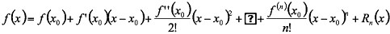
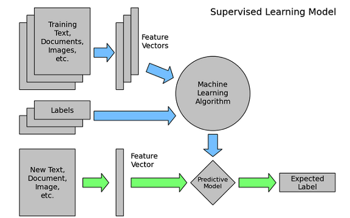
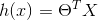
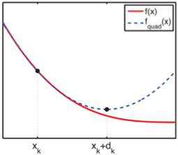

<link href="http://github.com/yrgoldteeth/darkdowncss/raw/master/darkdown.css" rel="stylesheet"></link> 

# taylor展开式和拟牛顿

### taylor展开式：

如果f(x)在某一点n阶可导，则f(x)可泰勒展开：

### 泰勒展开式的应用：

1. 初等函数值计算，例如：

2. Taylor公式的应用2：解释Gini系数（在决策树章节会用到）
将f(x)=-lnx在x=1处一阶展开，忽略高阶无穷小，得到f(x)≈1-x

3. Taylor公式的应用3：平方根算法

  

# 拟牛顿
### 梯度下降算法

上面的图是一个机器学习常见的流程，其中假说函数h(x),损失函数J(θ)，J(θ)是衡量模型（假说函数好话的函数）

错误损失函数：

求min（ J(θ) ）

初始化θ(随机初始化)

沿着负梯度方向迭代，更新后的θ使J(θ)更小

### 利用泰勒展开式
若f(x)二阶导连续，将f(x)在xk处Taylor展开

对其求导，因为求极值所以其导数为0，得到：

**上述公式就是牛顿法**

* 牛顿法是在Xk点做的虚线抛物线
* 梯度下降算法是在Xk点做的切线

# 牛顿法的特点：
1. 牛顿法具有二阶收敛性，在某些目标函数(如线性回归、Logistic回归等)的问题中，它的收敛速度比梯度下降要快。
2. 经典牛顿法虽然具有二次收敛性，但是要求初始点需要尽量靠近极小点，否则有可能不收敛。
* 如果Hessian矩阵奇异，牛顿方向可能根本不存在。
* 若Hessian矩阵不是正定，则牛顿方向有可能是反方向。
3. 计算过程中需要计算目标函数的二阶偏导数的逆，时间复杂度较大。

**从而引出了拟牛顿，常用的拟牛顿算法有：**

* DFS vidon – Fletcher – Powell
* BFGS：Broyden – Fletcher – Goldfarb - Shanno
