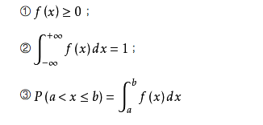
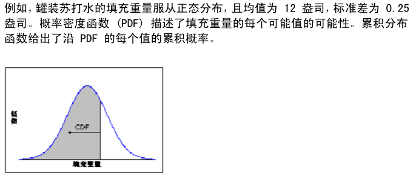
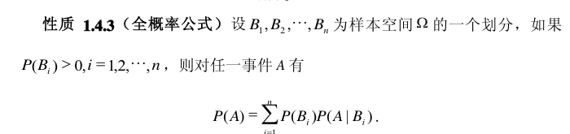
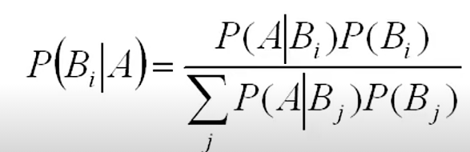
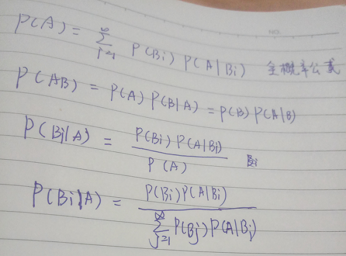
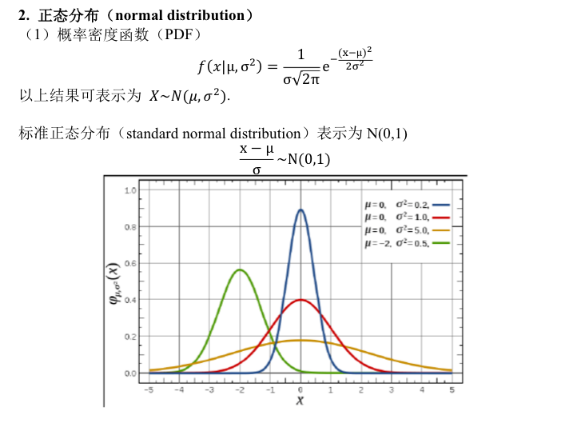
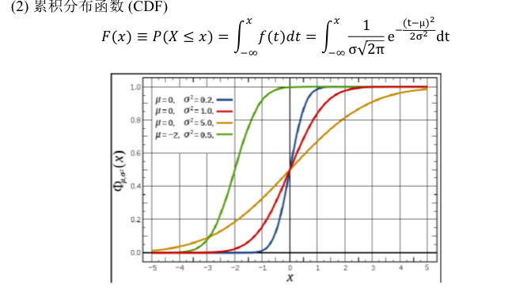
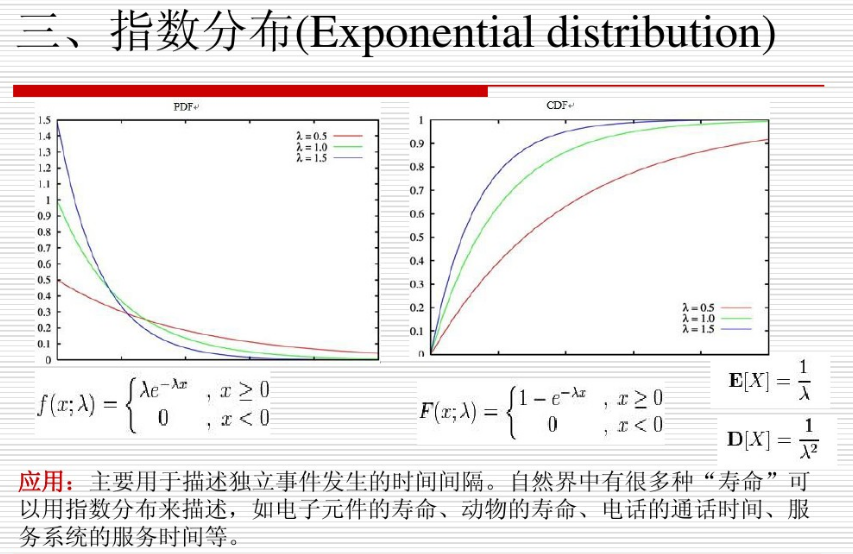

# 概率论基础

## 概念
### PDF （probability density function）

概率密度函数简称PDF，这里指的是一维连续随机变量，多维连续变量也类似。随机数据的概率密度函数：表示瞬时幅值落在某指定范围内的概率，因此是幅值的函数。它随所取范围的幅值而变化。  
密度函数f(x) 具有下列性质：  

### CDF（cumulative distribution function）
CDF又名累计分布函数，用如下的例子说明：

  
  

  
### 条件概率

### 全概率公式

### 贝叶斯公式

### 贝叶斯公式的推导过程

### 频率学派和贝叶斯学派
举个现实点的例子，比如预测明天4月2号的气温，频率派可能抓取历史N年的4月2日的气温数据（为了稳定，可能也会4月2日前后一周的气温数据），然后得到均值和方差，然后得到一个温度范围及其置信度。贝叶斯学派可能根据之前的先验知识（地理位置，经济状况，政策……）估计到一个先验温度分布，然后根据当前这些因素的采样数据，用相似度去修正先验概率，得到一个修正后的后验概率分布。

[参考链接](http://www.tuicool.com/articles/AfaU3ay)

### 正态分布

### 均匀分布

### 指数分布

### 二项分布

### 几何分布

