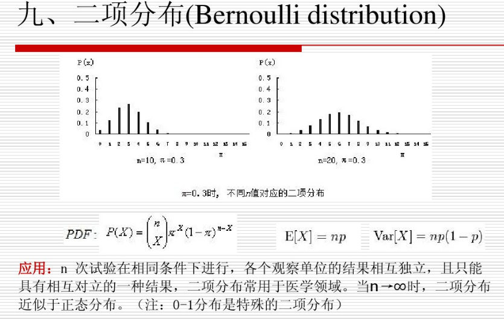
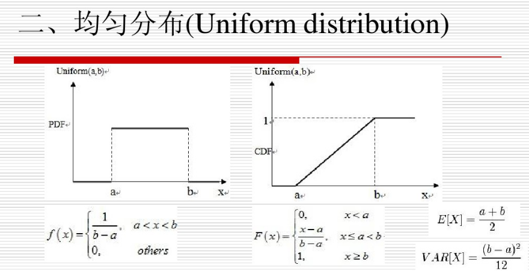
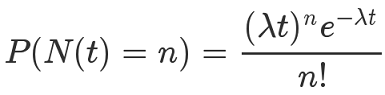
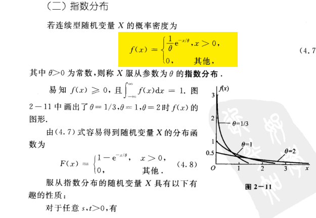
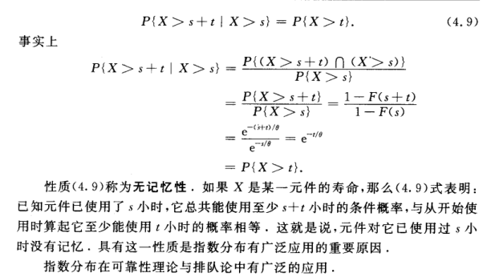
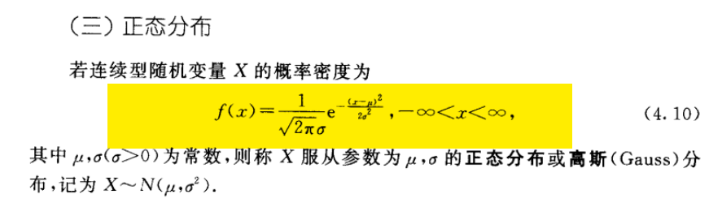
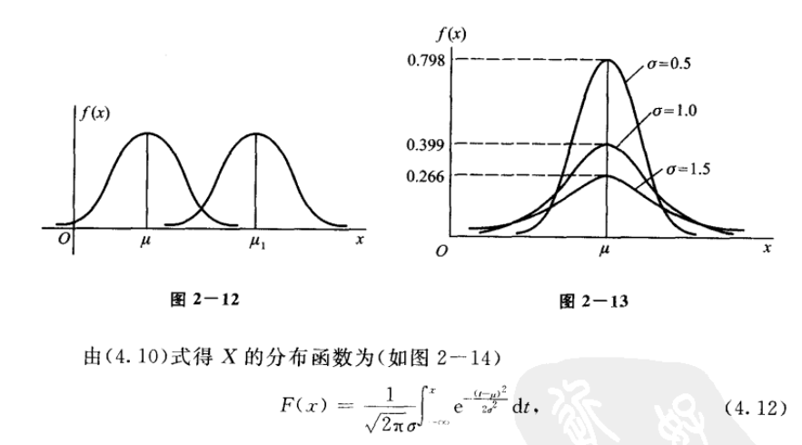
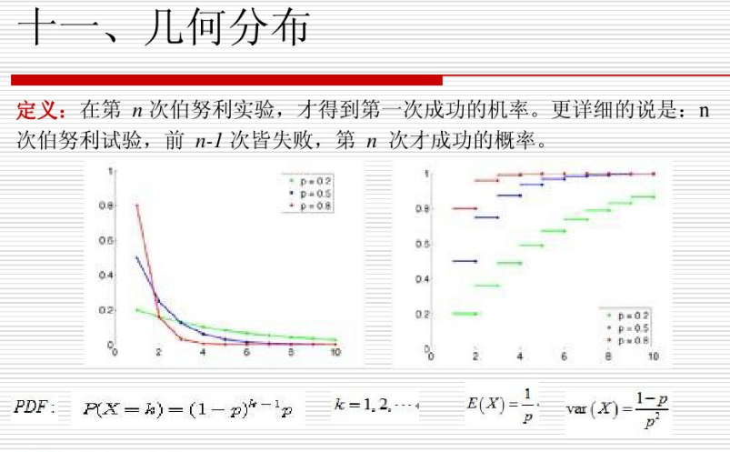
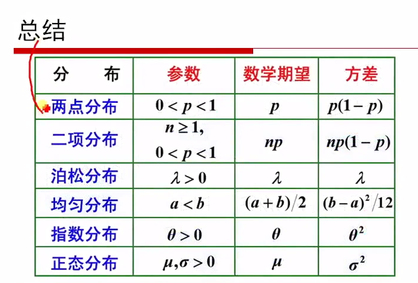
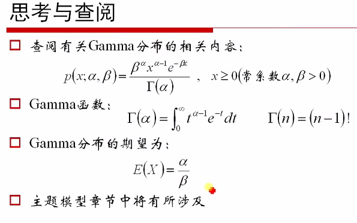

# 3.各种分布

### 二项分布

### 均匀分布

### 泊松分布
*日常生活中，大量事件是有固定频率的。* 

> *某医院平均每小时出生3个婴儿*
> *某公司平均每10分钟接到1个电话*
> *某超市平均每天销售4包xx牌奶粉*
> *某网站平均每分钟有2次访问*

它们的特点就是，我们可以预估这些事件的总数，但是没法知道具体的发生时间。已知平均每小时出生3个婴儿，请问下一个小时，会出生几个？

关于公式推导和理解，我这里强烈推荐[阮一峰的网络日志:泊松分布和指数分布：10分钟教程](http://www.ruanyifeng.com/blog/2015/06/poisson-distribution.html)

### 指数分布
指数分布是事件的时间间隔的概率。下面这些都属于指数分布。

> 婴儿出生的时间间隔
> 来电的时间间隔
> 奶粉销售的时间间隔
> 网站访问的时间间隔

指数分布的公式可以从泊松分布推断出来。如果下一个婴儿要间隔时间 t ，就等同于 t 之内没有任何婴儿出生。

### 正态分布

### 几何分布

### 总结

### 补充说明
1. 关于泊松分布和指数分布
2. Gamma分布在后续章节会有所涉及。

