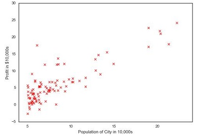
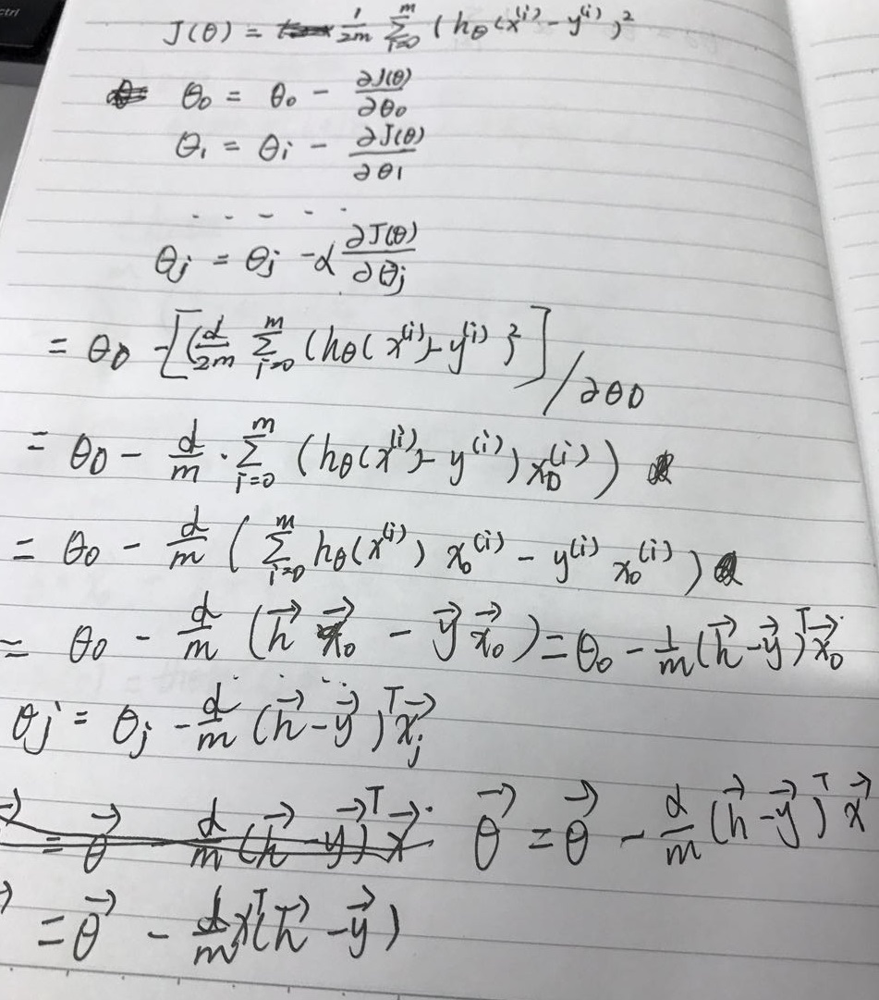
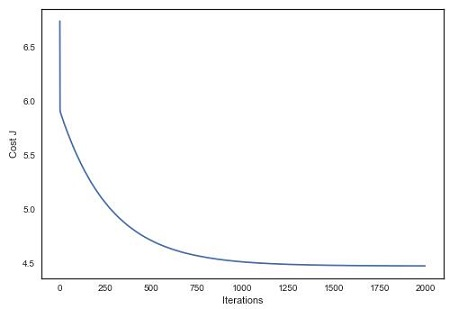
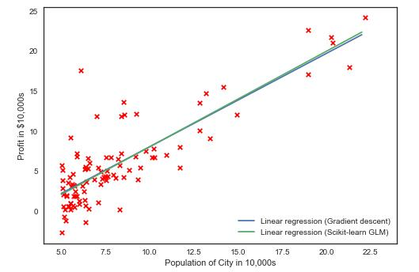

# 线性回归模型代码实战（linear regression practice）

## 摘要（brief）

使用[python数据分析环境搭建](https://github.com/bobkentt/Learning-machine-from-scratch-/blob/master/practice/python-environment-install.md)中搭建的python环境，一个线性回归的例子，最后用梯度下降算法做最优化。

## 包导入（package import）

```
# %load ../../standard_import.txt
import pandas as pd
import numpy as np
import matplotlib.pyplot as plt

from sklearn.linear_model import LinearRegression
from mpl_toolkits.mplot3d import axes3d

pd.set_option('display.notebook_repr_html', False)
pd.set_option('display.max_columns', None)
pd.set_option('display.max_rows', 150)
pd.set_option('display.max_seq_items', None)

#%config InlineBackend.figure_formats = {'pdf',}
%matplotlib inline  

import seaborn as sns
sns.set_context('notebook')
sns.set_style('white')
```
### 样本集导入（sample set import）

```
# 导入当前目录下的样本集文件linear_regression_data1.txt
# 样本feature之间以逗号分隔
data = np.loadtxt('linear_regression_data1.txt', delimiter=',')

# features
# np.ones(data.shape[0])是偏执项b
X = np.c_[np.ones(data.shape[0]),data[:,0]]

# labels
y = np.c_[data[:,1]]

```

### 画单变量的样本散点图（plot）

```
plt.scatter(X[:,1], y, s=30, c='r', marker='x', linewidths=1)
plt.xlim(4,24)
plt.xlabel('Population of City in 10,000s')
plt.ylabel('Profit in $10,000s');
```
[更多关于scatter的用法](https://github.com/bobkentt/Learning-machine-from-scratch-/blob/master/practice/lib-usage/scatter.md)



### 损失函数（loss function）

线性回归损失函数：


代码如下：

```
# 计算损失函数
def computeCost(X, y, theta=[[0],[0]]):
    m = y.size
    J = 0

    h = X.dot(theta)

    J = 1.0/(2*m)*(np.sum(np.square(h-y)))

    return J
```

#### 关于numpy运算:
* *nmpy.sum：
[点我跳转查看官方文档](https://docs.scipy.org/doc/numpy/reference/generated/numpy.sum.html#numpy.sum)*
* *nmpy.square：
[点我跳转查看官方文档](https://docs.scipy.org/doc/numpy/reference/generated/numpy.square.html#numpy.square)*
* *更多运算请参考：
[点我跳转查看官方文档](https://docs.scipy.org/doc/numpy/reference/routines.math.html)*

### 线性回归与梯度下降算法（linear regression and gradient descent）

#### 公式：

根据梯度下降算法的推导公式：



```
def gradientDescent(X, y, theta=[[0],[0]], alpha=0.01, num_iters=2000):
    m = y.size
    J_history = np.zeros(num_iters)
    for iter in np.arange(num_iters):
        h = X.dot(theta)
        theta = theta - alpha * (1.0/m) * X.T.dot(h-y)
        J_history[iter] = computeCost(X,y,theta)
    return (theta, J_history)
```

### 画出每一次迭代和损失函数变化(plot loss function)

```
# 画出每一次迭代和损失函数变化
theta , Cost_J = gradientDescent(X, y)
print('theta: ',theta.ravel())

plt.plot(Cost_J)
plt.ylabel('Cost J')
plt.xlabel('Iterations');
```



### 画出h曲线，并与scikit-learn库中的线性回归对比一下

```
xx = np.arange(5,23)
yy = theta[0]+theta[1]*xx

# 画出我们自己写的线性回归梯度下降收敛的情况
plt.scatter(X[:,1], y, s=30, c='r', marker='x', linewidths=1)
plt.plot(xx,yy, label='Linear regression (Gradient descent)')

# 和Scikit-learn中的线性回归对比一下
regr = LinearRegression()
regr.fit(X[:,1].reshape(-1,1), y.ravel())
plt.plot(xx, regr.intercept_+regr.coef_*xx, label='Linear regression (Scikit-learn GLM)')

plt.xlim(4,24)
plt.xlabel('Population of City in 10,000s')
plt.ylabel('Profit in $10,000s')
plt.legend(loc=4);
```



更多关于scikit-learn LinearRegression 的使用方法：
[点击链接下载](http://scikit-learn.org/stable/modules/generated/sklearn.linear_model.LinearRegression.html)

### 预测一下(predict)
```
# 预测一下人口为35000和70000的城市的结果
print(theta.T.dot([1, 3.5])*10000)
print(theta.T.dot([1, 7])*10000)
```

**预测结果**
[ 4519.7678677]
[ 45342.45012945]

### 完整的代码(code download)
[点击链接跳转完整的代码-](https://github.com/bobkentt/Learning-machine-from-scratch-/blob/master/practice/code/linear_regression_practice.ipynb)


